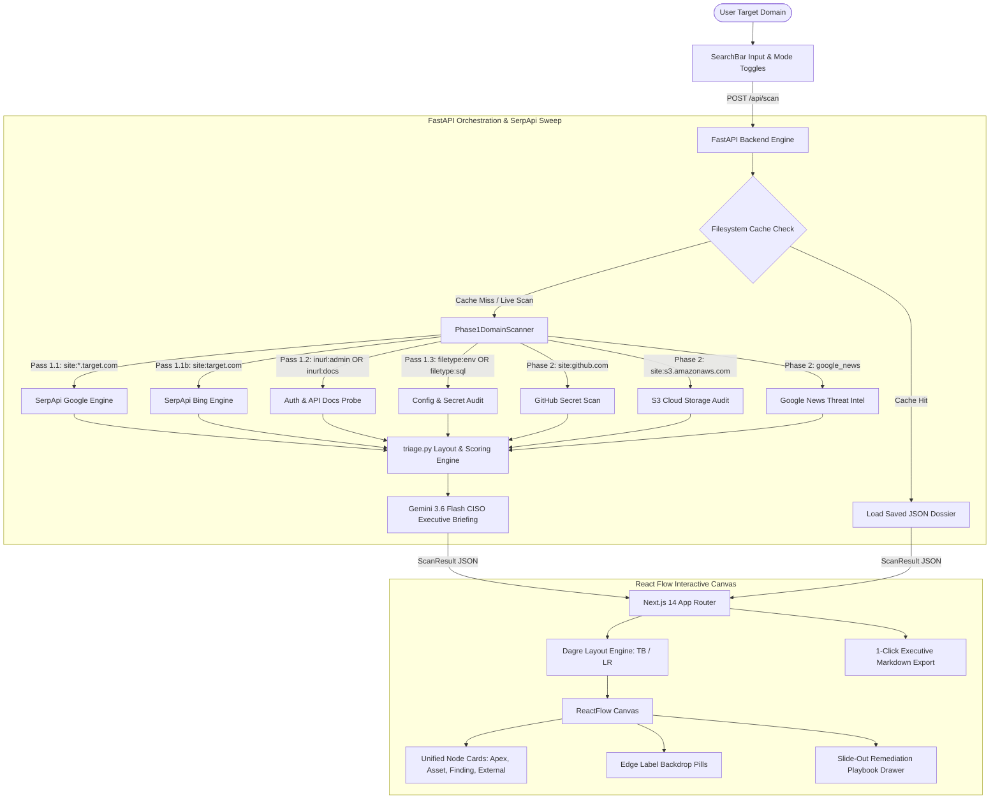

# 🛡️ ReconFlow AI
### Autonomous External Attack Surface Management & Threat Intelligence Agent
**Track Selection:** Track 01 — AI Agents (SerpApi MCP Native)  
**Hackathon:** SerpApi India Hackathon 2026 · Target Deadline: October 5, 2026, 23:59 IST  
**Cost to Run:** $0 / ₹0 (Operates 100% within SerpApi Free Tier + Localhost)

---

## 📌 Executive Summary

Engineering teams deploy microservices, cloud storage, and staging clusters faster than internal security operations can catalog them. This rapid iteration inevitably creates **Shadow IT**: forgotten staging subdomains, unauthenticated API documentation portals (`/swagger-ui`, `/graphiql`), and misconfigured web roots exposing `.env` files or database dumps to public search engine crawlers.

Security analysts know search engines continuously index these assets. The defensive standard to detect them is **Google Dorking**. However:
1. **Aggressive Bot Defenses:** Google triggers bot blocks, CAPTCHAs, and IP rate-limits after 3–5 rapid automated requests.
2. **Scattered Output:** Legacy scripts dump raw terminal text or CSV logs that lack hierarchical relationship context.
3. **No Remediation Context:** Flagging a vulnerability without providing the exact web server directive or cloud policy leaves the organization exposed.

**ReconFlow AI bridges this gap by converting SerpApi into an autonomous, defensive EASM agent.** Given an enterprise target domain, ReconFlow uses SerpApi's proxy infrastructure and `serpapi-search-tools` to execute a multi-pass reconnaissance sweep, eliminates false positives, categorizes risks under OWASP & CWE standards, and maps the entire attack perimeter onto an **interactive, color-coded node graph with copy-paste defensive remediation playbooks**.

---

## 🏗️ System Architecture & Data Flow

ReconFlow AI adopts the tools officially recommended by SerpApi Developer Advocates (**Adarsh Divakaran** and **Tomas Murua**):
- **`serpapi-search-tools`**: SerpApi's official Python package for AI agent tools.
- **SerpApi MCP Server**: Integrates with the official Model Context Protocol server (`https://mcp.serpapi.com/`).
- **Multi-Engine Intelligence**: Cross-engine perimeter verification using `google`, `google_light`, `bing`, and `google_news`.



---

## ✨ Key Features & Technical Highlights

### 1. Dynamic Graph Layout Toggle (Vertical vs. Horizontal)
Switch between **Vertical** (top-to-bottom) and **Horizontal** (left-to-right) rank orientations with a single click. Dagre auto-layout re-calculates spatial coordinates in real time, and node connection handles dynamically adjust position (`left/right` or `top/bottom`).

### 2. Automatic Canvas Framing (`fitView`)
Wrapped inside ReactFlowProvider with an automated `fitView` trigger that centers and scales the full attack surface graph cleanly on screen upon scan load, filter change, or layout toggle.

### 3. Edge Label Backdrops & Wire Overlap Prevention
Relationship labels (`EXPOSES_API`, `EXPOSES_SECRET`, `CODE_LEAK`, `HOSTS`) feature dark slate backdrop pills with rounded corners, avoiding wire overlap and text collisions.

### 4. Unified Node Card Architecture
All 4 node card types follow a standardized visual design system (`240px` width, `12px` corner radius, `16px` padding, soft `border-white/[0.08]` opacity, elevated `#141a24` surface):
- **Apex Domain Node**: Center target domain with Info severity badge.
- **Host Asset Node**: Discovered subdomains with Low severity badge.
- **Internal Finding Node**: Auth portals, API docs, and `.env` leaks with ambient critical pulse animation.
- **External Exposure Node**: GitHub credential leaks and S3 cloud storage buckets with dashed border styling.

### 5. Dark-Theme Desaturated Badge Color Palette
- **Low**: Background `#0f2e22` | Text `#4ade9b`
- **Medium**: Background `#3a2b0a` | Text `#ffc26b`
- **High**: Background `#3a2013` | Text `#ff9d6b`
- **Critical**: Background `#3a1418` | Text `#ff6b6a`
- **Info**: Background `#10253d` | Text `#6fb2f5`

### 6. Borderless Stat / Metric Cards
Metric cards feature large `26px` font-medium numbers with background differentiation (`#141a24`), removing hard border lines for a clean presentation.

### 7. Readable Thought Stream Log Feed
Agent thoughts are rendered in a fixed-height (`h-48`) scrolling panel using readable `12px` typography, preserving layout stability while streaming logs.

### 8. OWASP & CWE Mapped Remediation Playbooks
Selecting any node opens a slide-out drawer providing copy-paste defensive directives (NGINX rules, Apache rules, AWS CLI commands, git-filter-repo scripts).

### 9. 1-Click Executive Markdown Dossier Export
Generates a downloadable Markdown report complete with executive briefings, security score, risk breakdowns, Google snippets, and remediation steps.

---

## 🔍 Resilient Dorking Matrix

### Phase 1: Internal Perimeter (Domain-Only)
* **Pass 1.1: Subdomain Harvesting**
  * *Primary Query:* `site:*.{target} -www.{target}`
  * *Engine:* `google` + `bing` cross-validation
  * *Severity:* `Info` / `Low`
* **Pass 1.2: Unauthenticated API Documentation Gateways**
  * *Primary Query:* `site:{target} (inurl:admin OR inurl:login OR inurl:portal OR inurl:auth OR inurl:docs OR inurl:api OR inurl:dashboard)`
  * *Severity:* `Medium` (OWASP A01:2021 / CWE-215)
* **Pass 1.3: Sensitive Configuration Files & Database Dumps**
  * *Primary Query:* `site:{target} (filetype:env OR filetype:sql OR filetype:yaml OR filetype:log OR filetype:bak OR intitle:"index of /")`
  * *Severity:* `Critical` (OWASP A05:2021 / CWE-200)

### Phase 2: Third-Party & Shadow IT Expansion
* **Pass 2.1: Public Code Repository Leaks (GitHub)**
  * *Query:* `site:github.com "{target}" (filename:.env OR filename:credentials OR filename:secrets.json OR "BEGIN RSA PRIVATE KEY") -inurl:issues -inurl:pull`
  * *Severity:* `Critical` (OWASP A07:2021 / CWE-312)
* **Pass 2.2: Misconfigured Cloud Storage (AWS S3 & GCS)**
  * *Query:* `(site:s3.amazonaws.com/{brand} OR site:storage.googleapis.com/{brand} OR site:*.s3.amazonaws.com "{target}")`
  * *Severity:* `High` (OWASP A01:2021 / CWE-552)
* **Pass 2.3: Threat Intelligence News**
  * *Query:* `"{brand}" (security OR vulnerability OR breach OR exploit OR incident)`
  * *Engine:* `google_news`
  * *Severity:* `Info` (OSINT advisory)

---

## ⚙️ Environment Variables

Create a `.env` file in the root or `backend/` directory:

| Variable | Required? | Default | Description |
| :--- | :--- | :--- | :--- |
| `SERPAPI_KEY` | Optional | `""` | SerpApi API key. If omitted, scanner runs in zero-credit simulated mode. |
| `GEMINI_API_KEY` | Optional | `""` | Gemini API key for dynamic AI CISO executive summaries. |
| `HOST` | Optional | `0.0.0.0` | Backend bind host address. |
| `PORT` | Optional | `8001` | Backend port number. |
| `NEXT_PUBLIC_API_URL` | Optional | `http://localhost:8001` | Frontend target API URL. |

---

## 🚀 Local Setup & Quickstart

### Prerequisites
- Python 3.9+
- Node.js 18+ (tested on Node v20/v22/v25)

### Option A: Automated Script (Linux / macOS / Git Bash)
```bash
chmod +x start_dev.sh
./start_dev.sh
```

### Option B: Manual Step-by-Step

#### 1. Backend Setup
```bash
cd backend
python3 -m venv .venv
source .venv/bin/activate  # On Windows: .venv\Scripts\activate
pip install -r requirements.txt
python3 -m uvicorn app.main:app --reload --port 8001
```
*Verify Backend*: Open `http://localhost:8001/health` $\rightarrow$ `{"status": "ok", "service": "ReconFlow AI EASM Agent"}`

#### 2. Frontend Setup
```bash
cd frontend
npm install
npm run dev
```
*Verify Frontend*: Open `http://localhost:3000` in your browser.

---

## 🌐 Production Deployment Guide

### Deploying Frontend to Vercel
1. Push your repository to GitHub.
2. Import the project in [Vercel](https://vercel.com).
3. Set **Root Directory** to `frontend`.
4. Add Environment Variable:
   - `NEXT_PUBLIC_API_URL` = `https://your-backend-service.onrender.com`
5. Click **Deploy**.

### Deploying Backend to Render / Railway
1. Create a Web Service on [Render](https://render.com) or [Railway](https://railway.app).
2. Set **Root Directory** to `backend`.
3. Set **Build Command**: `pip install -r requirements.txt`
4. Set **Start Command**: `uvicorn app.main:app --host 0.0.0.0 --port $PORT`
5. Add Environment Variables:
   - `SERPAPI_KEY` = `your_serpapi_key`
   - `GEMINI_API_KEY` = `your_gemini_key`

---

## 🛡️ Zero-Cost ($0) Benchmark Demo Mode
ReconFlow includes a built-in filesystem caching layer (`backend/cache/demo_mock.json` & `frontend/lib/demo_mock.json`):
- Click **"Benchmark Demo"** in the UI to instantly load `demo-sandbox.corp`.
- Allows frontend testing, zoom/pan evaluation, and video rehearsal with **0 SerpApi credit burn**.
- Live scans consume only **3 to 4 SerpApi queries**, allowing 60–80 full enterprise scans within SerpApi's free tier (250 searches/month).

---

## 📄 License & Hackathon Submission
MIT License. Built for the SerpApi India Hackathon 2026.
