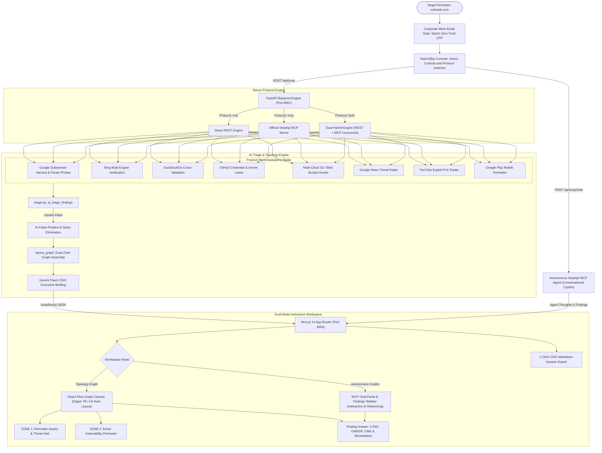

# 🛡️ ReconFlow AI
### Autonomous External Attack Surface Management & Threat Intelligence Agent

[](https://fastapi.tiangolo.com/)
[](https://nextjs.org/)
[](https://serpapi.com/)
[](https://stytch.com/)
[](https://stripe.com/)
[](LICENSE)

**Hackathon:** SerpApi India Hackathon 2026 · Target Deadline: October 5, 2026, 23:59 IST  
**Cost to Run:** $0 / ₹0 (Operates 100% within SerpApi Free Tier + Localhost)  
**Methodology:** 100% Pure Search Intelligence & Passive Reconnaissance (Multi-Engine SerpApi EASM)

---

## 📌 Executive Summary & The SerpApi Hero Narrative

Engineering teams deploy microservices, cloud storage, and staging clusters faster than internal security operations can catalog them. This rapid iteration inevitably creates **Shadow IT**: forgotten staging subdomains, unauthenticated API documentation portals (`/swagger-ui`, `/graphiql`), exposed cloud storage buckets (AWS S3, Azure Blob, Google Cloud Storage), and misconfigured web roots exposing `.env` files or database dumps to public search engine crawlers.

Security analysts know search engines continuously index these assets. The defensive standard to detect them is **Google Dorking**. However:

> **The Fundamental Problem:**  
> If an enterprise security team tries to automate Google Dorking internally, Google's anti-bot systems issue CAPTCHAs and block their IPs by query #4.  
> **SerpApi's proxy rotation, multi-engine routing, and structured JSON parsing are the ONLY reason ReconFlow AI can exist.**

ReconFlow AI converts SerpApi into a 100% autonomous, defensive External Attack Surface Management (EASM) agent. Given a target domain, ReconFlow uses SerpApi's proxy network and `serpapi-search-tools` to execute a multi-engine reconnaissance sweep across **Google, Bing, DuckDuckGo, YouTube, Google News, and Google Play Store**. It categorizes risks under OWASP & CWE standards and renders the entire attack perimeter onto an **interactive, color-coded node graph with copy-paste defensive remediation playbooks and an autonomous conversational AI Copilot**.

---

## ⚖️ Ethical Boundary & Non-Intrusive Methodology

ReconFlow AI adheres to a strict defensive perimeter standard:

| What ReconFlow Does ✅ | What ReconFlow NEVER Does 🚫 |
| :--- | :--- |
| Queries public search indexes via SerpApi proxies (Google, Bing, DDG, YouTube, Play Store) | **Zero** exploitation payloads or remote code execution attempts |
| Discovers exposed cloud storage buckets (AWS S3, Azure Blob, GCS) via indexed search engines | **Zero** brute-force directory fuzzing or port scanning |
| Surfaces public leaked credentials and secrets indexed in public repos/code pastes | **Zero** socket connections or network probing against target infrastructure |
| Audits shadow IT documentation portals and exposed environment configurations | **Zero** disruptive traffic or denial-of-service simulations |

---

## 🎯 Demo Targets & Legal/Optics Hygiene

To maintain the highest legal and ethical hygiene during presentations, live audits, and video reviews:
1. **Primary Live Target:** `vulnweb.com` (industry-standard Acunetix vulnerable web testbed) — safely demonstrates live multi-engine discovery of realistic web exposures, SQL injection indicators, XSS parameters, and administrative consoles with zero ethical ambiguity.
   - Demo Corporate Work Email: `security@vulnweb.com`
   - Master Demo Verification Passcode: `748291` (or instant on-screen generated code)
2. **Production Baseline:** `reconflow.ai` / `reconflow.render.com` — demonstrates a hardened, secure perimeter exhibiting zero false positives and a clean **"Perimeter Secure"** Zone 2 posture.
3. **Offline Sandbox Mode:** Run with `demo-sandbox.corp` or offline cache — displays staged security anomalies without any external network traffic.

---

## 🏗️ System Architecture & Data Flow

ReconFlow AI incorporates official tools recommended by SerpApi Developer Advocates (**Adarsh Divakaran** and **Tomas Murua**):
- **Official SerpApi MCP Server**: Connects via JSON-RPC to `https://mcp.serpapi.com/` for compact, token-efficient AI agent queries (-60% LLM token overhead).
- **`AutonomousMCPAgent`**: Autonomous reasoning agent dynamically formulating search dorks, invoking MCP search tools, and analyzing telemetry.
- **Triple-Protocol Engine**: Dynamic protocol switching between **Direct REST (`rest`)**, **Official SerpApi MCP (`mcp`)**, and **Dual Hybrid (`both`)** with automatic link deduplication.
- **Multi-Engine Intelligence**: Cross-engine perimeter verification across `google`, `google_light`, `bing`, `duckduckgo`, `youtube`, `google_news`, and `google_play`.



---

## 📁 Repository & Directory Structure

```
reconflow.ai/
├── README.md                      # Primary project documentation & architecture guide
├── RENDER_DEPLOYMENT.md           # Step-by-step production deployment instructions for Render.com
├── render.yaml                    # Infrastructure-as-Code Blueprint for Render services
├── start_dev.sh                   # One-command development runner (FastAPI + Next.js)
├── changes.txt                    # Comprehensive architectural change log & feature history
├── .env.example                   # Environment configuration template
│
├── backend/                       # Python FastAPI Backend (Port 8001)
│   ├── requirements.txt           # Python dependencies (FastAPI, requests, stripe, pydantic)
│   ├── app/
│   │   ├── main.py                # FastAPI routes (scans, MCP chat, Stytch auth, Stripe checkout)
│   │   ├── schemas.py             # Pydantic data contracts (GraphNode, FindingMetadata, ScanResult)
│   │   ├── config.py              # Environment variable loader & credential helpers
│   │   ├── cache.py               # Deterministic JSON cache reader/writer
│   │   ├── remediation.py         # OWASP & CWE defensive playbooks (NGINX, AWS, DNS)
│   │   └── services/
│   │       ├── phase1_domain.py   # Multi-engine search orchestrator (REST, MCP, and Hybrid)
│   │       ├── phase2_external.py # Cloud storage hunter (S3, Blob, GCS) & external threat radar
│   │       ├── mcp_agent.py       # Autonomous SerpApi MCP Agent reasoning over JSON-RPC
│   │       ├── serpapi_mcp_client.py # Low-level JSON-RPC client for https://mcp.serpapi.com/
│   │       └── triage.py          # Gemini Flash false-positive filter & CISO executive summarizer
│   ├── cache/                     # Offline fixtures & target cache (e.g., demo_mock.json)
│   └── tests/                     # Unit test suites
│
└── frontend/                      # Next.js 14 App Router Frontend (Port 3000)
    ├── package.json               # Frontend dependencies (@xyflow/react, lucide-react, three)
    ├── next.config.js             # SWC optimization & package import treeshaking
    ├── tailwind.config.js         # Security-grade dark theme design system & palette
    ├── app/
    │   ├── layout.tsx             # Root layout with font preloading & ThemeContext
    │   ├── page.tsx               # High-converting landing page with Hero, Pricing & Tech Radar
    │   ├── recon/page.tsx         # Dual-mode workspace (Network Graph + MCP Conversational Copilot)
    │   └── globals.css            # Dark theme, React Flow styling, and custom animations
    ├── components/
    │   ├── HeroSection.tsx        # Hero section with live search input & target presets
    │   ├── SearchBar.tsx          # Scan console with Dork Matrix toggles & Protocol Switcher
    │   ├── GraphCanvas.tsx        # React Flow canvas with Dagre TB/LR orientation & fitView
    │   ├── MCPChatPanel.tsx       # Conversational AI copilot with live tool execution traces
    │   ├── MCPFindingsSidebar.tsx # Real-time findings overview, grade display & quick-drills
    │   ├── FindingDrawer.tsx      # Slide-out drawer with CVSS scores, CWE codes & copy-paste fixes
    │   ├── SummaryCards.tsx       # Borderless attack surface KPI cards with grade badges
    │   ├── ThoughtStream.tsx      # Terminal log stream displaying SerpApi search execution
    │   ├── CorporateAuthModal.tsx # Zero-Trust work email modal (Stytch OTP verification)
    │   ├── PaymentModal.tsx       # Stripe Checkout modal with transparent annual discount
    │   ├── PricingSection.tsx     # SerpApi query-aligned pricing tiers ($0, $39, $99, $199)
    │   ├── RemediationSection.tsx # Copy-paste defensive playbooks showcase
    │   └── nodes/                 # Standardized 240px custom graph nodes (Root, Asset, Finding, External)
    └── lib/
        ├── layout.ts              # Dagre automated graph layout calculation (TB / LR rankdir)
        ├── dossier.ts             # 1-Click CISO Executive Markdown dossier generator
        └── types.ts               # TypeScript data models mirroring backend Pydantic schemas
```

---

## 🔍 Resilient Multi-Engine Dorking Matrix

| Pass | Engine | Target Query / Syntax | Objective & Standard | Severity |
| :--- | :--- | :--- | :--- | :--- |
| **1.1** | `google` | `site:{target} -www.{target}` | Subdomain harvesting via Google index | `Info` / `Low` |
| **1.1b**| `bing` | `site:{target} -www.{target}` | Cross-engine subdomain verification | `Info` / `Low` |
| **1.1c**| `duckduckgo`| `site:{target} -www.{target}` | Independent index cross-validation | `Info` |
| **1.2** | `google` | `site:{target} (inurl:admin OR inurl:portal OR inurl:docs OR inurl:api)` | Unauthenticated documentation / portals (OWASP A01) | `Medium` |
| **1.3** | `google` | `site:{target} (filetype:env OR filetype:sql OR filetype:yaml OR filetype:bak)` | Sensitive configuration & database dumps (OWASP A05 / CWE-200) | `Critical` |
| **1.4** | `google` | `site:{target} inurl:id= OR inurl:cat= OR inurl:artist=` | Parameterized endpoint audit for SQL injection / XSS risks | `Medium` |
| **2.1** | `google` | `site:github.com "{target}" (filename:.env OR "BEGIN RSA PRIVATE KEY")` | Public code repository credential exposure (OWASP A07) | `Critical` |
| **2.2** | `google` | `(site:s3.amazonaws.com/{brand} OR site:storage.googleapis.com/{brand} OR site:*.blob.core.windows.net "{brand}")` | Multi-Cloud Storage Hunter: AWS S3, Azure Blob, GCS with light-touch RFC check | `Critical` / `High` |
| **2.3** | `google_news`| `"{brand}" (security OR vulnerability OR breach OR exploit)` | Real-time threat intelligence & incident alerts | `Info` |
| **2.4** | `youtube`| `"{brand} vulnerability" OR "{brand} exploit poc"` | Security researcher exploit video radar | `Info` |
| **2.5** | `google_play`| `q="{brand}"` | Mobile application perimeter assets | `Info` |
| **2.6** | `google` | User-defined custom query (e.g. `site:{target} inurl:grafana`) | **Ungated Dork Hunting**: Custom signatures with `{target}` and `{brand}` variables | `High` / `Med` |

---

## ✨ Key Features & Technical Highlights

### 1. Autonomous SerpApi MCP Agent & Conversational Copilot
- **Live MCP Reasoning**: Integrated via `backend/app/services/mcp_agent.py` and `POST /api/mcp/chat`. Users can interact conversationally (e.g., *"Check for exposed S3 buckets"*, *"Look for credential leaks on GitHub"*, or *"Tell me how to remediate finding #1"*).
- **Dynamic Tool Dispatch**: The agent formulates targeted Google Dork queries on the fly and calls the official SerpApi MCP tools via JSON-RPC.
- **Interactive UI**: `MCPChatPanel.tsx` displays real-time agent thoughts, tool execution badges, structured finding cards with direct remediation drawer triggers, and quick-prompt chips.

### 2. Triple Recon Protocol Support (REST, MCP, Both)
- **Direct REST (`rest`)**: Fast, parallel HTTP requests against the SerpApi REST API.
- **Official SerpApi MCP (`mcp`)**: Native JSON-RPC queries to `https://mcp.serpapi.com/` providing compact structured outputs (-60% LLM token overhead).
- **Dual Hybrid Engine (`both`)**: Simultaneously triggers REST and MCP queries, combining and deduplicating results across both protocols for maximum perimeter visibility.

### 3. Dual-Zone Topology Graph + Phase 2 Threat Radar
- **Zone 1: Assets & Intel** — Apex domains, subdomains, mobile applications, and YouTube researcher PoCs.
- **Zone 2: Vulnerability Perimeter** — Critical and high-risk exposures (unauthenticated APIs, exposed `.env` files, SQL/XSS parameters, missing DMARC/SPF).
- **Layout Direction Toggle**: Switch between **Vertical** (top-to-bottom) and **Horizontal** (left-to-right) orientations instantly with Dagre auto-layout and automatic canvas framing (`fitView`).

### 4. Zero-Trust Corporate Work Email Gate (Stytch)
Enforces verified ownership of the target domain before initiating reconnaissance. Analysts submit their work email (e.g., `security@vulnweb.com`) and confirm a one-time passcode (OTP) via Stytch B2B/Consumer verification.

### 5. Multi-Cloud Bucket Hunter with RFC Verification
Searches across **AWS S3, Azure Blob Storage, Google Cloud Storage, and DigitalOcean Spaces**. Inspects response headers non-intrusively to distinguish public open directory listings (`<ListBucketResult>`) from restricted (`403 AccessDenied`) assets.

### 6. Transparent Unit-Economics Pricing & Subscription Tiers
Pricing mapped directly to SerpApi query quotas:
- **Community ($0)**: 1 Target Domain Audit (First Scan Free trial).
- **Starter ($39/mo)**: 3 Audits/day (~100 scans/mo, 1,000 SerpApi queries/mo).
- **Developer ($99/mo)**: 15 Audits/day (~450 scans/mo, 5,000 SerpApi queries/mo, Autonomous MCP Agent).
- **Production ($199/mo)**: 50 Audits/day (~1,500 scans/mo, 15,000 SerpApi queries/mo, Dual Hybrid Engine).
- Backed by automated Stripe Checkout integration (`POST /api/create-checkout-session`).

### 7. 1-Click CISO Executive Markdown Dossier Export
Generates an executive CISO dossier containing the executive briefing, numeric security posture score (0–100), letter grade (A–F), threat intelligence radar, and copy-paste remediation playbooks (NGINX, AWS CLI, git-filter-repo, SPF/DMARC).

---

## 📡 Complete REST & MCP API Reference

| Method | Endpoint | Description | Request Payload | Response Summary |
| :--- | :--- | :--- | :--- | :--- |
| `GET` | `/` | Root API service information & routes | None | JSON service metadata & version |
| `GET` | `/health` | Service health & MCP readiness probe | None | `{"status": "ok", "mcp_enabled": true}` |
| `POST` | `/api/scan` | Execute autonomous attack surface sweep | `{domain, protocol, enable_phase2, use_cache, custom_dorks, enabled_vectors}` | Complete `ScanResult` JSON with nodes, edges, thoughts, and summary |
| `POST` | `/api/mcp/chat` | Autonomous SerpApi MCP Agent Copilot | `{domain, message, existing_nodes}` | Agent reasoning, tool calls, and discovered findings |
| `POST` | `/api/auth/send-otp` | Corporate domain gate verification OTP | `{email, domain}` | Dispatch confirmation (Stytch B2B / Demo testbed) |
| `POST` | `/api/auth/verify-otp`| Verify 6-digit corporate passcode | `{email, domain, code}` | Authorization status & verification flag |
| `POST` | `/api/create-checkout-session` | Create Stripe checkout session | `{plan, amount, success_url, cancel_url}` | Stripe checkout URL & session ID |
| `GET` | `/api/cache/{domain}` | Retrieve cached scan dossier | None (Path param) | Stored `ScanResult` JSON |
| `GET` | `/api/remediation` | Retrieve all defensive playbooks | None | OWASP / CWE remediation playbooks dictionary |
| `GET` | `/api/engines` | Active SerpApi reconnaissance engines | None | Engine status dictionary & count |

---

## ⏱️ 3-Minute (180s) Video Rehearsal Script

| Timestamp | Phase | Visual / Screen Action | Spoken Narrative & Value Proposition |
| :--- | :--- | :--- | :--- |
| **0:00 – 0:25** | **The Hook** | Dashboard hero with Three.js particle wave and protocol selector. | *"Enterprises deploy faster than security teams can catalog. Forgotten subdomains and staging APIs leak into search engines. Automated Google dorking gets IP-blocked immediately—SerpApi is the hero that makes autonomous attack surface reconnaissance possible."* |
| **0:25 – 0:50** | **The Launch & Protocols** | Select `vulnweb.com`, showcase Protocol Switcher (REST / SerpApi MCP / Dual Hybrid). | *"ReconFlow AI runs 100% passive search intelligence. We select our execution mode: Direct REST, the official SerpApi MCP Server at mcp.serpapi.com, or Dual Hybrid to run both concurrently with zero invasive traffic."* |
| **0:50 – 1:40** | **Multi-Engine Intelligence** | Watch Thought Stream stream through Google, Bing, DDG, YouTube, Play Store. | *"Watch SerpApi sweep 6 engines: Google and Bing harvest subdomains, DuckDuckGo validates independently, YouTube flags exploit PoCs, Google Play discovers rogue mobile apps, and multi-cloud bucket hunting identifies storage leaks."* |
| **1:40 – 2:20** | **Interactive Graph & Remediation** | Switch Vertical $\rightarrow$ Horizontal layout, click finding node for drawer. | *"Zone 1 maps assets, Zone 2 isolates vulnerabilities. Clicking any finding displays CVSS scoring, CWE mappings, and copy-paste remediation playbooks for NGINX, AWS policies, and DNS records."* |
| **2:20 – 2:45** | **Autonomous MCP Agent Chat** | Switch to MCP Copilot tab, prompt *"Check for S3 buckets"*. | *"Here is our Autonomous SerpApi MCP Agent. It reasons over user intent, calls SerpApi MCP tools live, and investigates attack vectors conversationally."* |
| **2:45 – 3:00** | **The Finish** | Click **Export Dossier**, highlight letter grade & Markdown report. | *"One click exports an executive CISO dossier. 100% autonomous, $0 to run, powered by SerpApi. Thank you!"* |

---

## ⚙️ Environment Variables

Create a `.env` file in the root or `backend/` directory:

| Variable | Required? | Default | Description |
| :--- | :--- | :--- | :--- |
| `SERPAPI_KEY` | Recommended | `""` | SerpApi API key (https://serpapi.com/manage-api-key). Offline mode if omitted. |
| `GEMINI_API_KEY` | Optional | `""` | Google Gemini API key for dynamic AI CISO executive summaries and triage. |
| `HOST` | Optional | `0.0.0.0` | Backend bind host. |
| `PORT` | Optional | `8001` | Backend port number. |
| `NEXT_PUBLIC_API_URL` | Optional | `http://localhost:8001` | Frontend target API URL. |
| `STYTCH_PROJECT_ID` | Optional | `""` | Stytch Project ID for Corporate Work Email Zero-Trust Gate. |
| `STYTCH_SECRET` | Optional | `""` | Stytch Secret for Corporate Work Email OTP verification. |
| `STRIPE_SECRET_KEY` | Optional | `""` | Stripe Secret Key (`sk_test_...`) for subscription checkout sessions. |
| `STRIPE_PUBLISHABLE_KEY` | Optional | `""` | Stripe Publishable Key (`pk_test_...`). |
| `NEXT_PUBLIC_STRIPE_PUBLISHABLE_KEY` | Optional | `""` | Stripe Publishable Key for frontend Stripe Elements / Checkout redirect. |

---

## 🚀 Local Setup & Quickstart

### Prerequisites
- Python 3.9+
- Node.js 18+ (tested on Node v20/v22/v25)

### Option A: Automated One-Command Launcher (macOS / Linux)
```bash
chmod +x start_dev.sh
./start_dev.sh
```

### Option B: Manual Step-by-Step

#### 1. Backend Setup
```bash
cd backend
python3 -m venv .venv
source .venv/bin/activate  # On Windows: .venv\Scripts\activate
pip install -r requirements.txt
python3 -m uvicorn app.main:app --reload --port 8001
```
*Health Check*: Open `http://localhost:8001/health` $\rightarrow$ `{"status": "ok", "service": "ReconFlow AI EASM Agent"}`

#### 2. Frontend Setup
```bash
cd frontend
npm install
npm run dev
```
*UI Access*: Open `http://localhost:3000` in your browser.

---

## ☁️ Deployment Guide

ReconFlow AI is production-ready for deployment to **Render.com** using the included `render.yaml` Blueprint or manual web services. See [RENDER_DEPLOYMENT.md](file:///Users/yunohu/mohith%20folder/serp%20api/RENDER_DEPLOYMENT.md) for full instructions.

---

## 📄 License & Hackathon Submission
MIT License. Built for the **SerpApi India Hackathon 2026**.
