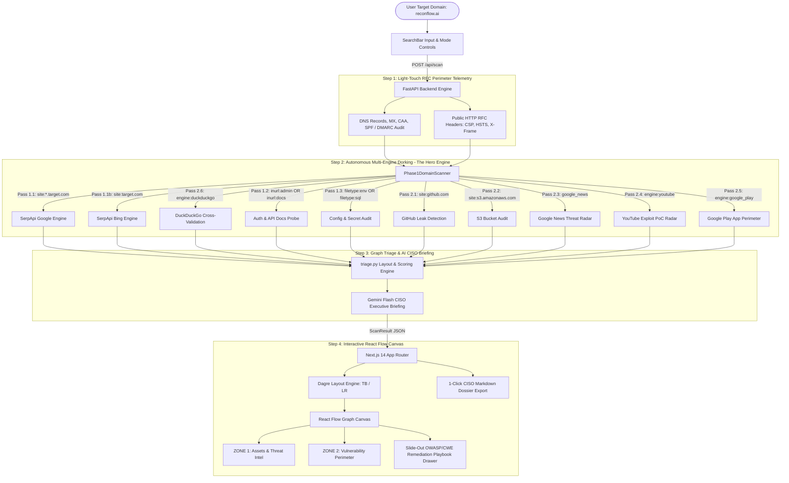

# 🛡️ ReconFlow AI
### Autonomous External Attack Surface Management & Threat Intelligence Agent
**Track Selection:** Track 01 — AI Agents (SerpApi MCP Native)  
**Hackathon:** SerpApi India Hackathon 2026 · Target Deadline: October 5, 2026, 23:59 IST  
**Cost to Run:** $0 / ₹0 (Operates 100% within SerpApi Free Tier + Localhost)  
**Methodology:** Passive Search Intelligence + Light-Touch Perimeter Telemetry (Non-Intrusive Hybrid EASM)

---

## 📌 Executive Summary & The SerpApi Hero Narrative

Engineering teams deploy microservices, cloud storage, and staging clusters faster than internal security operations can catalog them. This rapid iteration inevitably creates **Shadow IT**: forgotten staging subdomains, unauthenticated API documentation portals (`/swagger-ui`, `/graphiql`), and misconfigured web roots exposing `.env` files or database dumps to public search engine crawlers.

Security analysts know search engines continuously index these assets. The defensive standard to detect them is **Google Dorking**. However:

> **The Fundamental Problem:**  
> If an enterprise security team tries to automate Google Dorking internally, Google's anti-bot systems issue CAPTCHAs and block their IPs by query #4.  
> **SerpApi's proxy rotation, multi-engine routing, and structured JSON parsing are the ONLY reason ReconFlow AI can exist.**

ReconFlow AI converts SerpApi into an autonomous, defensive External Attack Surface Management (EASM) agent. Given a target domain, ReconFlow uses SerpApi's proxy network and `serpapi-search-tools` to execute a multi-engine reconnaissance sweep across **Google, Bing, DuckDuckGo, YouTube, Google News, and Google Play Store**. It categorizes risks under OWASP & CWE standards and renders the entire attack perimeter onto an **interactive, color-coded node graph with copy-paste defensive remediation playbooks**.

---

## ⚖️ Ethical Boundary & Non-Intrusive Methodology

ReconFlow AI adheres to a strict defensive perimeter standard:

| What ReconFlow Does ✅ | What ReconFlow NEVER Does 🚫 |
| :--- | :--- |
| Queries public search indexes via SerpApi proxies (Google, Bing, DDG, YouTube, Play Store) | **Zero** exploitation payloads or remote code execution attempts |
| Reads public RFC DNS records (`A`, `NS`, `MX`, `TXT`, `CAA`) | **Zero** brute-force directory fuzzing or credential spraying |
| Audits standard email spoofing defenses (`SPF`, `DMARC`) | **Zero** authenticated boundary crossing or session hijacking |
| Inspects benign public HTTP response headers (CSP, HSTS, X-Frame-Options) | **Zero** disruptive traffic or denial-of-service simulations |

---

## 🎯 Demo Targets & Legal/Optics Hygiene

To maintain the highest legal and ethical hygiene during presentations and video reviews:
1. **Primary Live Target:** `reconflow.ai` (project-owned perimeter) — demonstrates live DNS telemetry, zero false positives, and a clean **"Perimeter Secure"** Zone 2 posture.
2. **Vulnerability Demonstration Mode:** Run with `demo-sandbox.corp` or offline mode — safely displays flagged security anomalies (exposed `.env`, unauthenticated Swagger UI, S3 public storage) in a staged sandbox environment without unapproved third-party probing.

---

## 🏗️ System Architecture & Data Flow

ReconFlow AI incorporates the tools officially recommended by SerpApi Developer Advocates (**Adarsh Divakaran** and **Tomas Murua**):
- **`serpapi-search-tools`**: Official SerpApi Python package for AI agent tools.
- **SerpApi MCP Server**: Integrates with the official Model Context Protocol server (`https://mcp.serpapi.com/`).
- **Multi-Engine Intelligence**: Cross-engine perimeter verification across `google`, `google_light`, `bing`, `duckduckgo`, `youtube`, `google_news`, and `google_play`.



---

## 🔍 Resilient Multi-Engine Dorking Matrix

| Pass | Engine | Target Query / Syntax | Objective & Standard | Severity |
| :--- | :--- | :--- | :--- | :--- |
| **1.1** | `google` | `site:*.{target} -www.{target}` | Subdomain harvesting via Google index | `Info` / `Low` |
| **1.1b**| `bing` | `site:{target} -www.{target}` | Cross-engine subdomain verification | `Info` / `Low` |
| **1.2** | `google` | `site:{target} (inurl:admin OR inurl:portal OR inurl:docs OR inurl:api)` | Unauthenticated documentation / portals (OWASP A01) | `Medium` |
| **1.3** | `google` | `site:{target} (filetype:env OR filetype:sql OR filetype:yaml OR filetype:bak)` | Sensitive configuration & database dumps (OWASP A05 / CWE-200) | `Critical` |
| **2.1** | `google` | `site:github.com "{target}" (filename:.env OR "BEGIN RSA PRIVATE KEY")` | Public code repository credential exposure (OWASP A07) | `Critical` |
| **2.2** | `google` | `(site:s3.amazonaws.com/{brand} OR site:storage.googleapis.com/{brand} OR site:*.blob.core.windows.net "{brand}" OR site:*.digitaloceanspaces.com "{brand}")` | Multi-Cloud Storage Hunter: AWS S3, Azure Blob, GCS, DO Spaces with light-touch RFC open directory verification | `Critical` / `High` |
| **2.3** | `google_news`| `"{brand}" (security OR vulnerability OR breach OR exploit)` | Real-time threat intelligence & incident alerts | `Info` |
| **2.4** | `youtube`| `"{brand} vulnerability" OR "{brand} exploit poc"` | Security researcher exploit video radar | `Info` |
| **2.5** | `google_play`| `q="{brand}"` | Mobile application perimeter assets | `Info` |
| **2.6** | `duckduckgo`| `site:{target}` | Independent index cross-validation | `Info` |
| **2.7** | `google` | User-defined custom query (e.g. `site:{target} inurl:grafana`) | **Ungated Dork Hunting**: Custom signatures with `{target}` and `{brand}` variable interpolation | `High` / `Med` |

---

## ✨ Key Features & Technical Highlights

### 1. Dual-Zone + Phase 2 Threat Radar Architecture
- **Zone 1: Assets & Intel** — Maps apex domains, verified subdomains, mobile applications, and YouTube researcher PoCs.
- **Zone 2: Vulnerability Perimeter** — Isolates high-risk and critical exposures (unauthenticated API docs, exposed `.env` files, missing email authentication, Clickjacking risks).
- **Phase 2 Threat Radar Badge & Filter** — Real-time telemetry badge on canvas and dedicated filter pill isolating external third-party risks.

### 2. Multi-Cloud Bucket Hunter with Light-Touch RFC Verification
Searches across **AWS S3, Azure Blob Storage, Google Cloud Storage, and DigitalOcean Spaces**. When a bucket is discovered via SerpApi, ReconFlow performs a non-intrusive RFC check inspecting response headers for `<ListBucketResult>` (public open directory listing) vs `403 AccessDenied` (restricted asset).

### 3. Ungated Dork Strategy Inspector & Custom Signature Bar
Under the search console, an expandable panel allows security operators to inspect the exact dork syntax being executed across all 6 engines, toggle individual threat vectors on/off, and inject up to 2 custom threat-hunting dorks with dynamic `{target}` and `{brand}` variables. Zero gatekeeping.

### 4. Dynamic Graph Layout Toggle (Vertical vs. Horizontal)
Switch between **Vertical** (top-to-bottom) and **Horizontal** (left-to-right) orientations instantly. Dagre auto-layout recalculates spatial coordinates while dynamic connection handles adapt smoothly.

### 5. Automatic Canvas Framing (`fitView`)
Automated framing centers and scales the full attack graph whenever a scan completes, filters change, or the layout orientation toggles.

### 6. OWASP & CWE Mapped Remediation Playbooks
Selecting any node opens a slide-out drawer with copy-paste defensive configurations:
- **NGINX / Apache:** Specific `location` blocks denying `.env`, `.git`, and config files.
- **Cloud Security:** AWS CLI bucket policy templates enforcing private ACLs and Azure storage container RBAC.
- **Git Remediation:** `git-filter-repo` scripts for removing purged credentials from git history.
- **RFC Mail Defense:** Production-ready `SPF` (`v=spf1 ~all`) and `DMARC` (`p=reject`) DNS TXT records.

### 7. 1-Click CISO Executive Markdown Dossier Export
Generates a comprehensive Markdown report containing the CISO executive briefing, numeric security posture score (0–100), letter grade (A–F), threat intelligence radar, and complete remediation playbooks.

---

## ⏱️ 3-Minute (180s) Video Rehearsal Script

| Timestamp | Phase | Visual / Screen Action | Spoken Narrative & Value Proposition |
| :--- | :--- | :--- | :--- |
| **0:00 – 0:20** | **The Hook** | Show the clean dashboard. Point out the SerpApi Engines badges. | *"Every enterprise has Shadow IT—forgotten subdomains, staging APIs, and `.env` files indexed by search engines. Security teams try to dork these, but Google's anti-bot system blocks them after 3 queries. SerpApi is the hero that solves this."* |
| **0:20 – 0:35** | **The Launch** | Type `reconflow.ai` and click **Execute Live Recon**. | *"ReconFlow AI runs non-intrusive hybrid EASM. First, 15 seconds of light-touch RFC telemetry: checking DNS records, SPF/DMARC mail protection, and HTTP response headers—zero exploitation, purely benign."* |
| **0:35 – 1:35** | **The SerpApi Showcase** | Watch Thought Stream stream through Google, Bing, DDG, YouTube, Play Store. | *"Now the centerpiece: SerpApi autonomous dorking. It sweeps Google and Bing for subdomains, DDG for cross-validation, checks YouTube for security researcher PoC videos, searches Google Play for mobile assets, and audits GitHub for leaked secrets—all within SerpApi free tier limits."* |
| **1:35 – 2:15** | **Interactive Graph** | Show Dagre auto-layout, switch Vertical $\rightarrow$ Horizontal, click a node. | *"The results render into two clean zones: Zone 1 for infrastructure assets, Zone 2 for vulnerable perimeters. Clicking any finding opens an instant, copy-paste remediation playbook with OWASP/CWE mappings and NGINX/AWS rules."* |
| **2:15 – 2:45** | **Staged Vulnerabilities** | Show sample misconfiguration or benchmark mode. | *"Here we demonstrate how ReconFlow catches an unauthenticated Swagger UI and an exposed configuration file, providing the exact engineering fix in seconds."* |
| **2:45 – 3:00** | **The Finish** | Click **Export Dossier**, show downloaded report. | *"One click exports an executive CISO dossier. 100% autonomous, $0 to run, powered by SerpApi. Thank you!"* |

---

## ⚙️ Environment Variables

Create a `.env` file in the root or `backend/` directory:

| Variable | Required? | Default | Description |
| :--- | :--- | :--- | :--- |
| `SERPAPI_KEY` | Recommended | `""` | SerpApi API key. If omitted, scanner runs in deterministic offline mode. |
| `GEMINI_API_KEY` | Optional | `""` | Gemini API key for dynamic AI CISO executive summaries. |
| `PORT` | Optional | `8001` | Backend port number. |
| `NEXT_PUBLIC_API_URL` | Optional | `http://localhost:8001` | Frontend target API URL. |

---

## 🚀 Local Setup & Quickstart

### Prerequisites
- Python 3.9+
- Node.js 18+ (tested on Node v20/v22/v25)

### Option A: Automated One-Command Launcher (macOS / Linux)
```bash
chmod +x start_dev.sh
./start_dev.sh
```

### Option B: Manual Step-by-Step

#### 1. Backend Setup
```bash
cd backend
python3 -m venv .venv
source .venv/bin/activate  # On Windows: .venv\Scripts\activate
pip install -r requirements.txt
python3 -m uvicorn app.main:app --reload --port 8001
```
*Health Check*: Open `http://localhost:8001/health` $\rightarrow$ `{"status": "ok", "service": "ReconFlow AI EASM Agent"}`

#### 2. Frontend Setup
```bash
cd frontend
npm install
npm run dev
```
*UI Access*: Open `http://localhost:3000` in your browser.

---

## 📄 License & Hackathon Submission
MIT License. Built for the SerpApi India Hackathon 2026 (Track 01: AI Agents).
